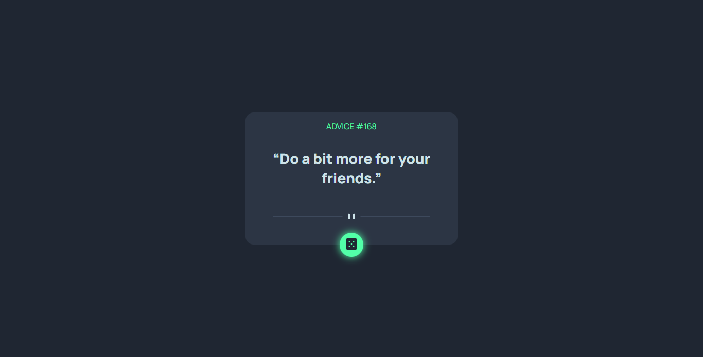
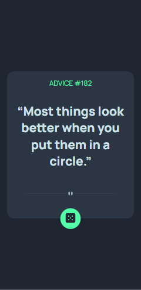

# Frontend Mentor - Advice generator app solution

This is a solution to the [Advice generator app challenge on Frontend Mentor](https://www.frontendmentor.io/challenges/advice-generator-app-QdUG-13db). Frontend Mentor challenges help you improve your coding skills by building realistic projects.

## Table of contents

- [Overview](#overview)
  - [The challenge](#the-challenge)
  - [Screenshot](#screenshot)
  - [Links](#links)
- [My process](#my-process)
  - [Built with](#built-with)
  - [What I learned](#what-i-learned)
  - [Continued development](#continued-development)
  - [Useful resources](#useful-resources)
- [Author](#author)
- [Acknowledgments](#acknowledgments)

**Note: Delete this note and update the table of contents based on what sections you keep.**

## Overview

Using the Fetch API in an asynchronous function to request for the advice slip Object
Users are to wait for 1 and half seconds for the advice to be displayed after clicking the dice button

### The challenge

Users should be able to:

- View the optimal layout for the app depending on their device's screen size
- See hover states for all interactive elements on the page
- Generate a new piece of advice by clicking the dice icon

### Screenshot

- Solution URL: [github repo](https://github.com/Timley53/Advice-generator)
- Live Site URL: [ live site ](https://timley-advice.netlify.app/)

### Built with

- CSS Grid
  -Asynchronous Javascript

### What I learned

working with the Async function and fetch API
also using the Try,catch and finally keyword

### Continued development

I'd like to continue to develop my knowledge about working with APIs

## Author

- Website - [AdedokunTimileyin] (https://www.linkedin.com/in/timileyin-adedokun-35b36b219)
- Frontend Mentor - [@TImley53] (https://www.frontendmentor.io/profile/Timley53)
- Twitter - [@timley_kun] (https://www.twitter.com/@timley_kun)
